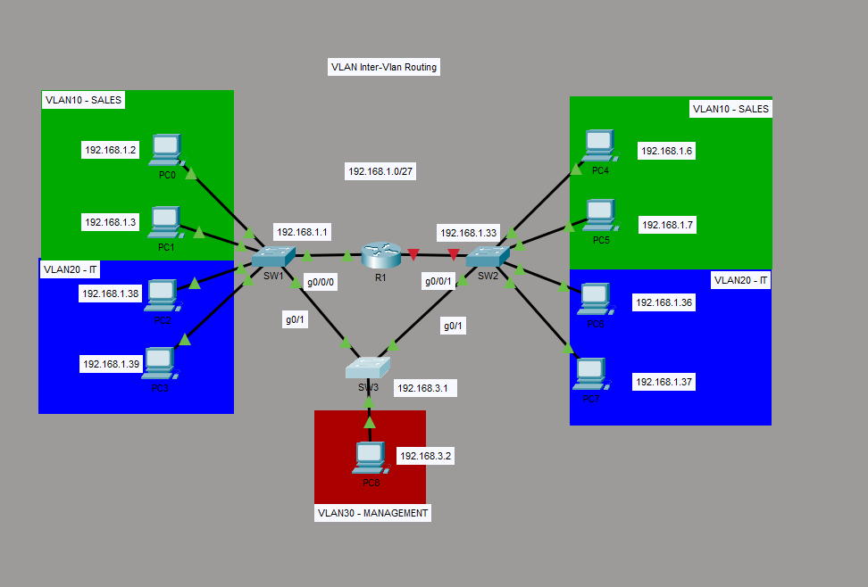

# 03 — Inter-VLAN Routing (Router-on-a-Stick)

## What I Built
A routed multi-VLAN network connecting Sales (VLAN 10), IT (VLAN 20), and Management (VLAN 30) across two access switches and a distribution switch, with a single router performing inter-VLAN routing using 802.1Q sub-interfaces (router-on-a-stick). This builds directly on Project 02's VLAN segmentation lab by adding Layer 3 routing on top of the existing trunked topology.

## Topology


| Device | Role |
|---|---|
| SW1 | Access switch — VLAN 10 (Sales), VLAN 20 (IT) |
| SW2 | Access switch — VLAN 10 (Sales), VLAN 20 (IT) |
| SW3 | Distribution switch — trunks to SW1 and SW2, access port for Management |
| R1 | Router-on-a-stick — sub-interfaces for VLAN 10, 20, and 30 |

SW1 and SW2 are not directly connected to each other. All inter-switch traffic, including same-VLAN traffic between SW1 and SW2, passes through SW3.

## IP Addressing Scheme

| VLAN | Name | Subnet | Gateway | Devices |
|---|---|---|---|---|
| 10 | SALES | 192.168.1.0/27 | 192.168.1.1 | PC0 (.2), PC1 (.3), PC4 (.6), PC5 (.7) |
| 20 | IT | 192.168.1.32/27 | 192.168.1.33 | PC2 (.38), PC3 (.39), PC6 (.36), PC7 (.37) |
| 30 | MANAGEMENT | 192.168.3.0/24 | 192.168.3.1 | PC8 (192.168.3.2) |

## Key Configuration

**R1 — Router-on-a-stick sub-interfaces:**
```
interface GigabitEthernet0/0/0.10
 encapsulation dot1Q 10
 ip address 192.168.1.1 255.255.255.224
!
interface GigabitEthernet0/0/0.20
 encapsulation dot1Q 20
 ip address 192.168.1.33 255.255.255.224
!
interface GigabitEthernet0/0/0.30
 encapsulation dot1Q 30
 ip address 192.168.3.1 255.255.255.0
```

**SW1 / SW2 — Trunk port to distribution switch:**
```
interface GigabitEthernet0/1
 switchport trunk encapsulation dot1q
 switchport mode trunk
```

**PC default gateways** were set to match each device's VLAN sub-interface (e.g., VLAN 10 hosts point to 192.168.1.1).

## Verification

| Test | Result |
|---|---|
| PC0 (VLAN10) → PC1 (VLAN10, same switch) | ✅ Success |
| PC0 (VLAN10) → PC4 (VLAN10, opposite switch) | ✅ Success (after fix — see below) |
| PC0 (VLAN10) → PC2 (VLAN20) | ✅ Success — routed through R1 |
| PC0 (VLAN10) → PC8 (VLAN30) | ✅ Success — routed through R1 |
| `tracert` PC0 → PC4 | ✅ Direct Layer 2 path, no router hop |
| `tracert` PC0 → PC2 | ✅ One hop through 192.168.1.1 |
| `show ip route` on R1 | ✅ All three sub-interface networks shown as directly connected |

## Troubleshooting Notes

**Issue:** PC0 (192.168.1.2, VLAN 10) could ping its default gateway and other VLAN 10 hosts on the same switch, but could not reach PC4 — also VLAN 10, but connected on the opposite access switch (SW2). PC4 was originally addressed as 192.168.1.34.

**Process:**
1. Verified trunk configuration on SW1, SW2, and SW3 with `show interfaces trunk` — VLAN 10 was allowed and active on every link.
2. Verified port assignments with `show vlan brief` — PC4's access port on SW2 was correctly in VLAN 10.
3. Checked `show spanning-tree vlan 10` on all three switches — no ports blocking, every trunk link forwarding.
4. Checked `show mac address-table vlan 10` on SW3 — VLAN 10 MAC addresses were only ever learned on the SW1-facing trunk port, never the SW2-facing one. This proved VLAN 10 traffic from SW2 was never reaching SW3, despite every config looking correct.
5. Ran `tracert` from PC0 to PC4 — the trace hit R1 (192.168.1.1) as the first hop, then timed out. Traffic for a same-VLAN destination was being routed instead of switched, meaning PC0 didn't consider PC4 to be on its local subnet.
6. Did the subnet math: PC0 (192.168.1.2/27) is on network 192.168.1.0/27 (range .1–.30). PC4 (192.168.1.34) falls in the next /27 block, 192.168.1.32/27 (range .33–.62) — a completely different subnet, even though both devices were switched into the same VLAN.

**Root cause:** VLAN 10 had been split across two non-contiguous /27 subnets. Devices in the same VLAN but different subnets cannot communicate over Layer 2 — the sending host's own subnet math forces the packet to the default gateway instead of ARPing locally. R1 also had no consistent path back to the second subnet, since its VLAN 10 sub-interface only owned the first /27 block.

**Fix:** Re-addressed PC4 and PC5 to 192.168.1.6 and 192.168.1.7 — inside the same /27 block as PC0 and PC1 — keeping the existing mask and gateway unchanged. No switch, trunk, or router configuration changes were required.

**Result:** PC0 → PC4 now succeeds in a single hop (confirmed via `tracert`), switching directly across SW1 → SW3 → SW2 with no router involvement, exactly as expected for same-VLAN traffic.

**Key takeaway:** VLAN membership (Layer 2) and subnet membership (Layer 3) are independent and both have to line up. Switches forward frames between any ports in the same VLAN regardless of IP addressing — but a host decides whether a destination is "local" purely from its own IP and subnet mask. Two devices in the same VLAN but different subnets will not reach each other directly; the sending host routes to its gateway, and the packet only succeeds if the router has a correctly tagged, correctly addressed path back to that subnet.

---

## Files in This Directory
| File | Description |
|---|---|
| README.md | This documentation file |
| 03-intervlan-routing.png | Network topology diagram |
| 03-intervlan-routing.pkt | Cisco Packet Tracer lab file |
| SW1_running-config.txt | Switch 1 running configuration |
| SW2_running-config.txt | Switch 2 running configuration |
| SW3_running-config.txt | Switch 3 running configuration |
| R1_running-config.txt | Router running configuration |

---

## Tools Used
- Cisco Packet Tracer 8.x
- GitHub for version control and documentation

## Previous Project
[Project 02 — VLAN Segmentation](../02-vlan-segmentation/) — Three-switch trunked topology establishing VLANs 10, 20, and 30 prior to adding routing.

## Next Project
Coming soon — Tier 2: Routing & Redundancy
